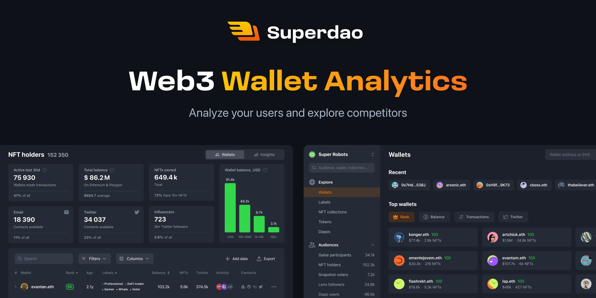

# Superdao

An open-source app built with Next.js App Router, Server Components, TypeScript, Tailwind CSS, and Base UI.



## About this project

Superdao is a learning project for exploring a modern Next.js application architecture. It is a pnpm monorepo for an audience and campaign-management workspace: explore wallets, labels, tokens, NFT collections, and applications; organize your team; and build campaigns for your community. Reusable primitives live in a dedicated UI package.

## Design

The interface is based on the [Superdao Growth Web App community file in Figma](https://www.figma.com/community/file/1276997317122667383/superdao-growth-web-app).

## Features

- Next.js App Router, layouts, and Server Components
- TypeScript across applications and packages
- Tailwind CSS v4 with shared design tokens
- A reusable `@superdao/ui` component library
- A searchable `/ui` catalog with live component previews
- Feature-Sliced Design for the web application
- pnpm workspaces and Turborepo task orchestration
- ESLint and Prettier for consistent code quality

## Repository structure

```text
apps/
  web/                Next.js application and product UI
  api/                Seeded read-only Next.js API for local development
packages/
  ui/                 UI primitives, components, and styles
  icons/              Icon components
  hooks/              React hooks
  lib/                Framework-agnostic utilities
  eslint-config/      ESLint configuration
  typescript-config/  TypeScript configuration
```

## Quick start

Install dependencies from the repository root:

```bash
pnpm install
```

Copy `apps/web/.env.example` to `apps/web/.env.local`, then start the complete local development environment:

```bash
pnpm dev
```

This starts the Next.js app and the seeded read-only API. Its versioned endpoints are available under `/api/v1`; the web client migration is tracked separately. Their published ports are defined in the project configuration and can be changed when needed.

To run only one service, use the package-specific aliases:

```bash
pnpm dev:web
pnpm dev:api
```

Docker Compose is an optional alternative when you want the services isolated from the host Node.js environment. Docker Engine or Docker Desktop with Compose v2 is required:

```bash
pnpm docker
```

The services are available on the published ports defined in the selected Compose file. Stop the stack with `pnpm docker:down`.

The equivalent commands are available for stopping the development stack and starting the production Compose variant:

```bash
pnpm docker:down
pnpm docker:prod
```

## Available commands

Run commands from the repository root. Aggregate commands use Turborepo; package aliases target one workspace directly.

```bash
pnpm dev
pnpm build
pnpm build:web
pnpm lint
pnpm typecheck
pnpm format

pnpm lint:web
pnpm lint:ui
pnpm lint:hooks
pnpm lint:icons
pnpm lint:lib

pnpm typecheck:web
pnpm typecheck:ui
pnpm typecheck:hooks
pnpm typecheck:icons
pnpm typecheck:lib

pnpm format:web
pnpm format:ui
pnpm format:hooks
pnpm format:icons
pnpm format:lib
```

The underlying workspace form is also available when you prefer an explicit package name:

```bash
pnpm --filter @superdao/web lint
pnpm --filter @superdao/ui typecheck
pnpm --filter @superdao/api test
```

`@superdao/eslint-config` and `@superdao/typescript-config` are configuration packages and do not expose runtime commands.

## License

Licensed under the [MIT License](LICENSE).
